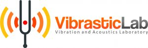

<p align="center">
  
</p>

# Vibrastic 101

Sharing workshop about speech and machine learning

## :triangular_flag_on_post: Venue

**Institut Teknologi Sepuluh Nopember, Surabaya**

19-20 October 2019 @ VIbrasticLab


## :wrench: Setup
### Environment Setup
```bash
virtualenv --python=python3 --no-site-packages venv
source venv/bin/activate
pip install jupyter
```

or directly head to [Google Colab](https://colab.research.google.com)

### Starting Jupyter
```bash
jupyter notebook
```

## :email: Contact 

Any correspondences can be done through my **telegram** account username : *@airminum*